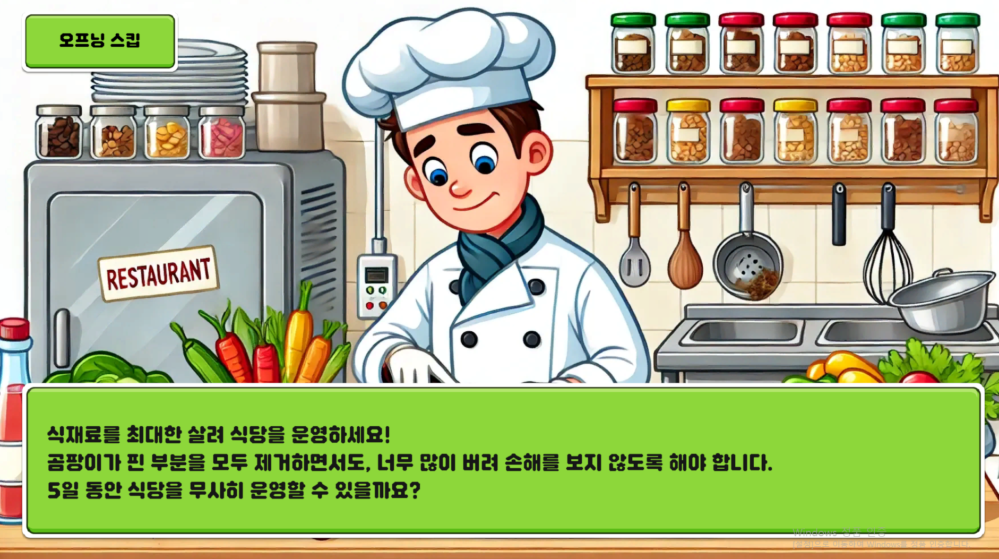
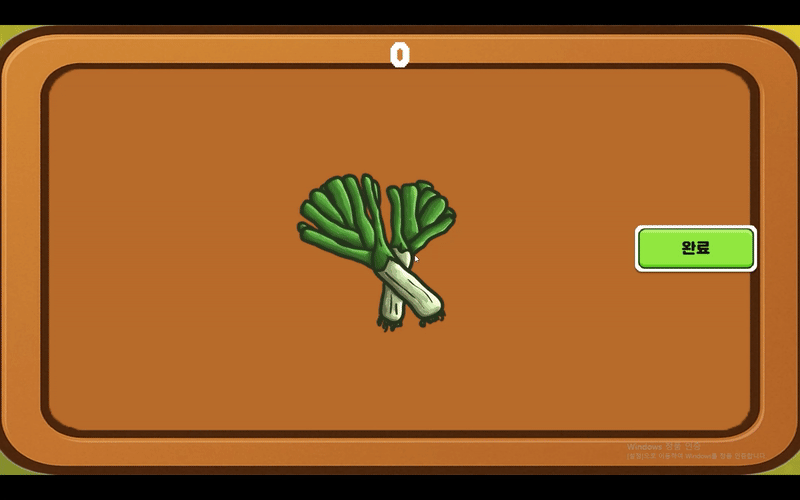
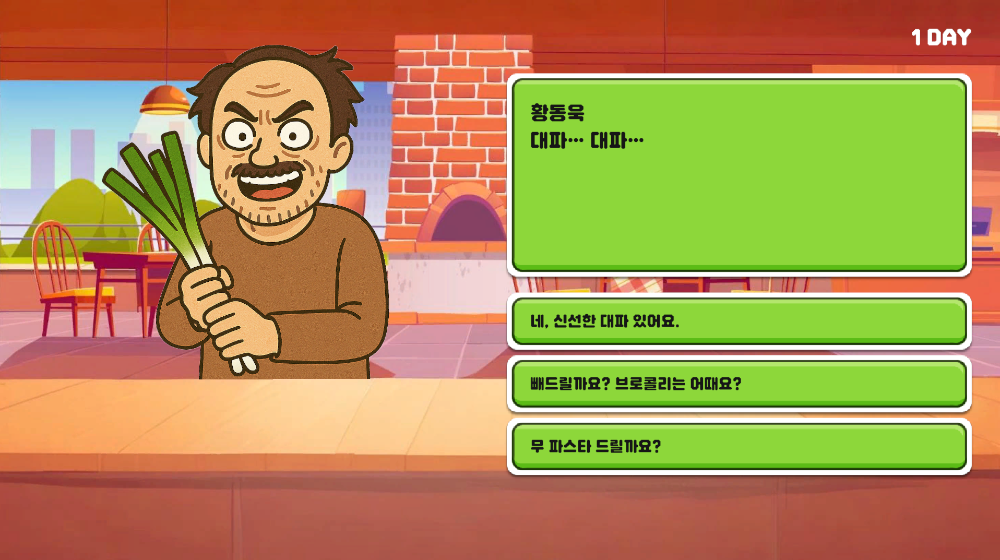
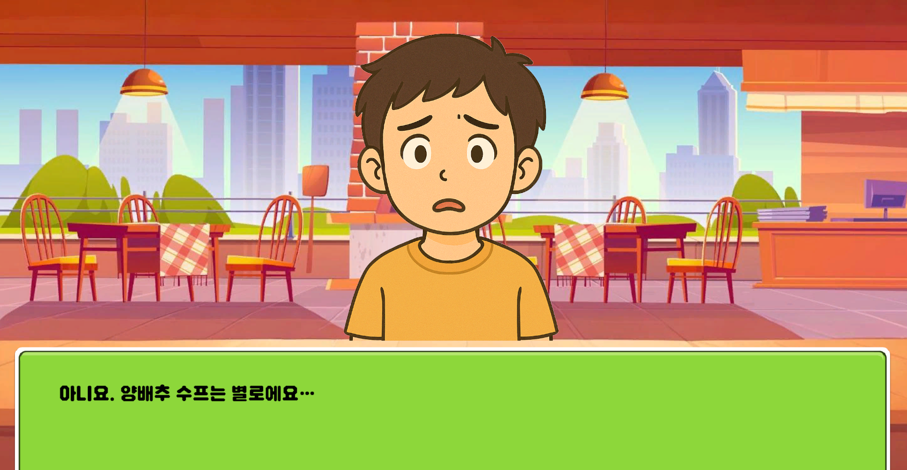
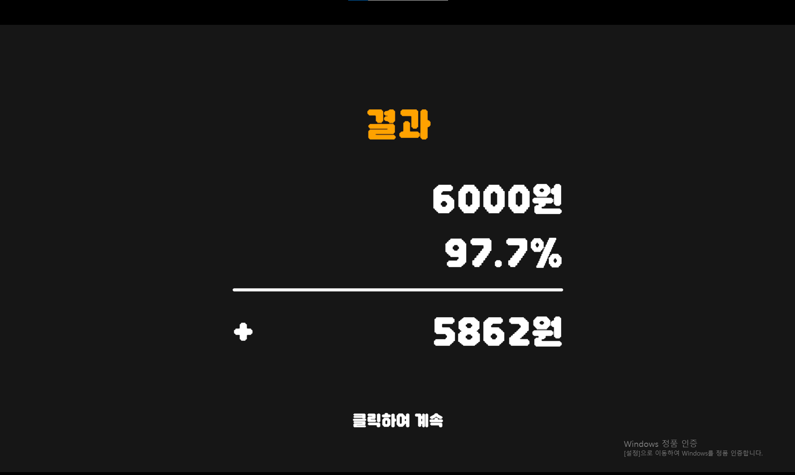
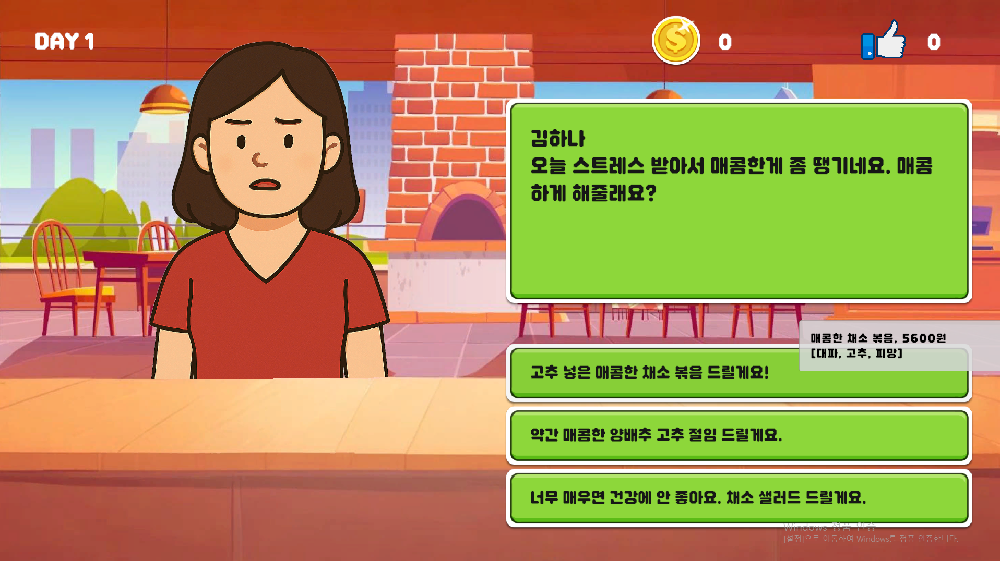
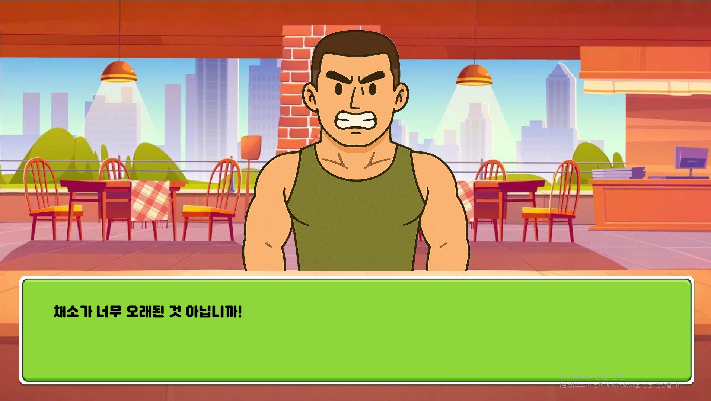
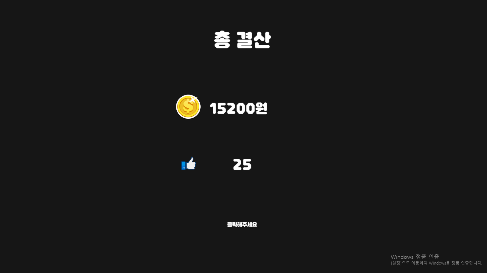
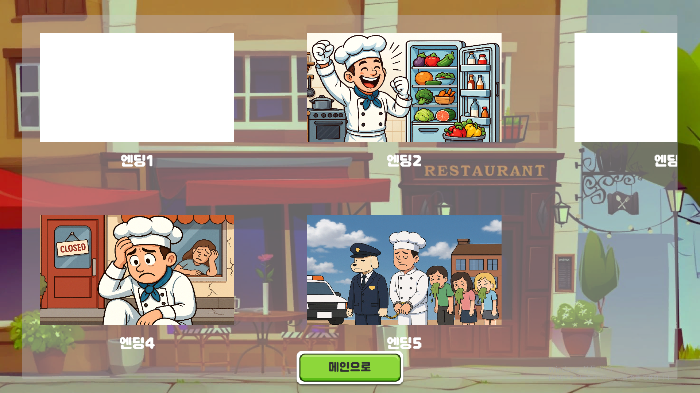

# 게임: 곰팡이 식당

### 개발 기간: 25.03.25. - 25.04.01 (1주)

**곰팡이를 잘라내며** 음식을 만드는 식당 **타이쿤 게임**

## 게임잼 랜덤 주제 : Decay(**부패, 부식)**

>
> 냉장고 고장으로 재료에 곰팡이가 피자,  
> 주인은 비밀리에 썩은 부분을 도려내며 위태로운 장사를 이어간다. 
> 과연 냉장고가 도착할 때까지 살아남을 수 있을까?
>
> **게임 제목** : 곰팡이 식당 
> **플레이 타임** : 5~10분 
> **게임 장르** : 타이쿤 
> **그래픽** : 2D 

---

<aside>

## 😝 구현하고자 했던 재미

- **곰팡이를 잘라낼 때의 쾌감**
- **유머**
- **손님과 상호작용하며 식당을 운영하는 재미**
</aside>

## 핵심 피처

- **마우스 드래그를 활용한 곰팡이 제거**
- **다양한 선택지와 반응**
- **재화 관리**

---

## ✔️ 플레이 테스트

### 0회차 빌드 피어 리뷰

- **재료 손질 완료하고 버튼을 계속 눌러야 하는게 피곤함**
- **잘라내는 듯한 느낌이 들지 않음**
- 결과창과 표정이 매칭이 되지 않음
- 손님 선택지의 존재가 명확하지 않음

### 1회차 빌드

- **곰팡이가 다 삭제되면 자동으로 다음 재료 불러옴**
- **칼질 이펙트와 떨어져 나가는 듯한 효과 추가**
- 결과와 표정 매칭시킴
- 손님 선택지의 다양성을 늘림
    

    

---

### 플레이 테스트 피드백

- **손님 선택지 고르는게 별 의미가 없다고 느껴짐**
- 후반에 너무 어려움
- 재료 손질 결과창이 빨리 스킵 됐으면 좋겠음
- 다회차 플레이의 이유가 있으면 좋겠음

### 2회차 빌드

- **손님 선택지에 따른 반응 추가**
- 전체적으로 재료 손질 난이도 조정
- 재료 손질 결과창에 금액, 손님 반응, 리액션 추가
- 엔딩 결과에 따른 다양한 엔딩 추가
    

    

---

### 플레이 테스트 피드백

- **엔딩을 보자마자 화면을 끄는 모습**
- 다회차 플레이를 할 이유가 없음
- 재료 손질이 잘 되지 않아 답답해 함
- 재료 손질 결과창 UI를 빨리 스킵하고 싶어함

### 3회차 빌드

- **엔딩 분기 및 앨범 추가**
- 손님의 스토리를 강화해 선택지를 더 고심해서 고르게 유도
- 재료 손질 결과창 UI 클릭하면 결과가 모두 나오게 함
- UI창에서 클릭 시 스킵 가능하도록 수정
     

---

### 플레이 테스트 피드백

- **칼질이 이어진 원을 그려야하는데 잘 안 이어져서 답답해하는 모습**
- 대화창에 매칭 되지 않는 음식이 있음

### 마지막 빌드

- **칼질 판정 수정**
- 음식 데이터 정보 수정

---

<aside>

## 🤢마우스 드래그를 통해 늘어나는 곰팡이를 잘라냄

> 재료가 시간이 지날수록 빠르게 썩어간다
> 
</aside>

- 플레이어가 마우스 드래그로 원을 그려 음식의 **곰팡이**를 제거
- 재료를 너무 많이 잘라내면 **수익이 줄어듬**

---

<aside>

## 🧑‍🍳 다양한 선택지에 맞는 음식과 반응

> 선택지를 잘 선택하여 인기도와 돈을 획득하자
> 
</aside>

- 선택지에 따라 손질해야 하는 **식재료와 얻을 수 있는 인기도**가 다름
- 다양한 손님이 방문하며, **같은 손님이 다시 방문하여** 다른 요청을 하기도 함

---

<aside>
💸

## 돈과 인기도 관리

> 돈과 인기도를 잘 관리하여 엔딩에 도달하자
> 
</aside>

- 얻은 돈과 인기도에 따라 **다양한 엔딩**이 있음
- 엔딩은 앨범을 통해 **다시 볼 수 있음**

---

# 플레이 테스트 관찰

- 곰팡이를 잘라내며 감탄사를 내뱉음
- 손님의 터무니 없는 요청사항과 반응을 보며 빵 터짐
- 고민하면서 선택지를 고르고 벌어들인 돈과 인기도를 보며 흐뭇해 함
- 일부러 부정적인 선택지를 고르며 웃음
- 엔딩을 보며 미소를 지음

<aside>

## 😝구현하고자 했던 재미

- **곰팡이를 잘라낼 때의 쾌감**
- **유머**
- **손님과 상호작용하며 식당을 운영하는 재미**
</aside>

---

## ⏪ 제작 회고

| **잘한 점** | **아쉬운 점** |
| --- | --- |
| 게임 볼륨을 적절하게 잡아서 주어진 시간에 작업하기 수월했다. | 타이쿤 요소를 더 추가하기에 시간이 부족해서 아쉽다. |
| 브레인스토밍으로 좋은 아이디어를 도출해냈다. | 메뉴별로 가격과 난이도를 변하게 했다면 더 다채로운 게임이 됐을거 같다. |
| 선을 그리는 기능을 잘 구현한 것 같다. 매니저 스크립트로 총괄하는 방식을 이해할 수 있었다. | 게임의 재미에 대해 고민을 할 시간이 부족했다. |
| AI와 에셋스토어를 통해 적절한 에셋을 잘 적용한 것 같다. | 어떤 재미를 줄지에 대해 얘기하는 시간이 짧았다. |
